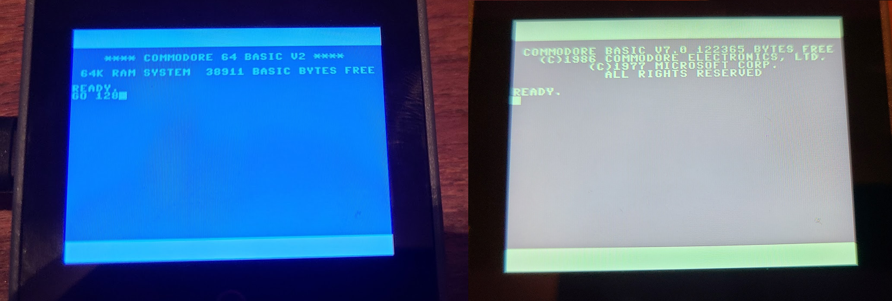

# Commodore 64, 128, Vic-20 text LCD emulator *Unified* #



Features include rendering full color screen on LCD and supporting multiple models.  60 times a second IRQ implemented to blink cursor. Requires SD (or FFAT partition) support for roms and .D64/1541 floppy emulation.   GO 128, GO 20, and GO 64 commands switch back and forth between systems.

## Compatible hardware ##

* M5Stack Core Fire
* M5Stack Core2 (supports optional wristband)
* M5Stack CoreS3 (supports optional wristband)
* Sunton ESP32-804S070
* Teensy 4.1 with PSRAM
* LilyGo T-Display-S3 (flash FAT partition instead of SD)

## Build instructions ##

1. Clone repository, switch to branch unified
2. Open src/c-simple-emu6502-cbm/c-simple-emu6502-cbm.ino with Arduino 2.x IDE
3. Build and deploy to compatible device, should complain "Card Mount Failed"
4. Insert MicroSD with the following files (roms from Vice or similar, disk files optional), and reset; or [detailed instructions for LilyGo T-Display-S3 with FFAT partition](https://github.com/davervw/c-simple-emu6502-cbm/tree/lilygo-t-display-s3)

```
roms\c64\basic
roms\c64\chargen
roms\c64\kernal
roms\c128\basiclo
roms\c128\basichi
roms\c128\chargen
roms\c128\kernal
disks\drive8.d64
disks\drive9.d64
```

Notes:

* LOAD/SAVE/VERIFY/LOAD"$" commands are intercepted by emulator.  There are some bugs in C128 for LOAD, so user beware.  There is no DOS for status, rename, delete, etc.  SAVE always ovewrites without warning in this emulator.
* GO 128 command added for switching to Commodore 128 mode (how? intercepted by the emulator).   Also GO 64, GO 20 working in these supported Commodore platforms.
* Keyboard is I2C attached M5Stack CardKB, or a serial attached helper that sends scan codes.  It can also be a web page -- see [browser-keyscan-helper](https://github.com/davervw/c-simple-emu6502-cbm/tree/m5/browser-keyscan-helper) with USB serial attachment, or a physical device attached to M5 Core Port.A -- see project [c128_keyscan](https://github.com/davervw/c128_keyscan/tree/ninetyone_tx2_itsy_bitsy).  I use both standard USB or Bluetooth keyboards, and my original C128D external keyboard.  
* Or keyboard is custom BLE server for serial or M5 CardKB (I2C) keyboard attached to M5Stack M5-Stick-C or similar (see [src/BLE_commodore_keyboard_server project](https://github.com/davervw/c-simple-emu6502-cbm/tree/unified/src/BLE_commodore_keyboard_server)) 
* Different hardware has different capabilities.  For example Teensy supports USB serial browser-keyscan-helper only (and soon again USB attached keyboard).  Teensy doesn't support BLE because it doesn't have a hardware radio (unless add an ESP32 circuit).  Attaching CardKB to platforms other than M5Stack may require additional work including interfacing circuit to adjust I2C to 3V3.  Only M5 Fire has three physical buttons that act as cursor up/down and Enter (also left two does Shift-Run, and outer left/right switch to next emulator).

See more description at blog entries:

* [extremely-small-emulated-c64](https://techwithdave.davevw.com/2023/06/extremely-small-emulated-c64.html)

Open src/browser-keyscan-helper/index.html to run an adapter with instructions how to use a keyboard via serial from a desktop web browser (e.g. Chrome).

