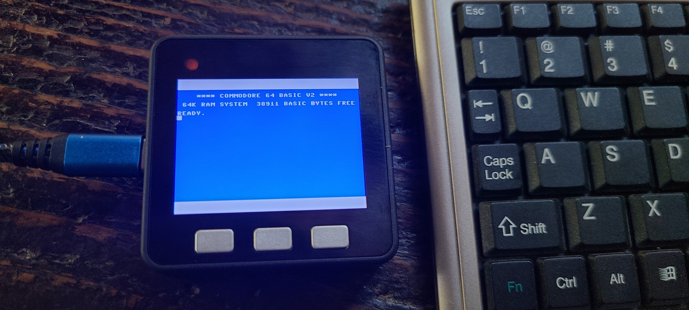

# M5Core C64 #

Work in progress.  Current state includes rendering full color screen on M5Core LCD and supporting multiple Core models with a define change in M5Core.h.  60 times a second IRQ implemented to blink cursor.   

Open browser-keyscan-helper/index.html to run an adapter with instructions how to use a keyboard via serial from a desktop web browser (e.g. Chrome). 

```
TODO: integrate web-serial-polyfill because Chrome mobile web browser doesn't support Serial APIs directly.
```

Note: with additional work one can integrate  in this solution for a mobile web browser (e.g. Chrome) that is missing the Serial APIs, and substitute use of USB APIs for CDC instead.

SD support not integrated yet (should be a simple port for Core2, CoreS3).




* Basic Core
* Core2
* CoreS3
* Whoops, screen not big enough on StickC
