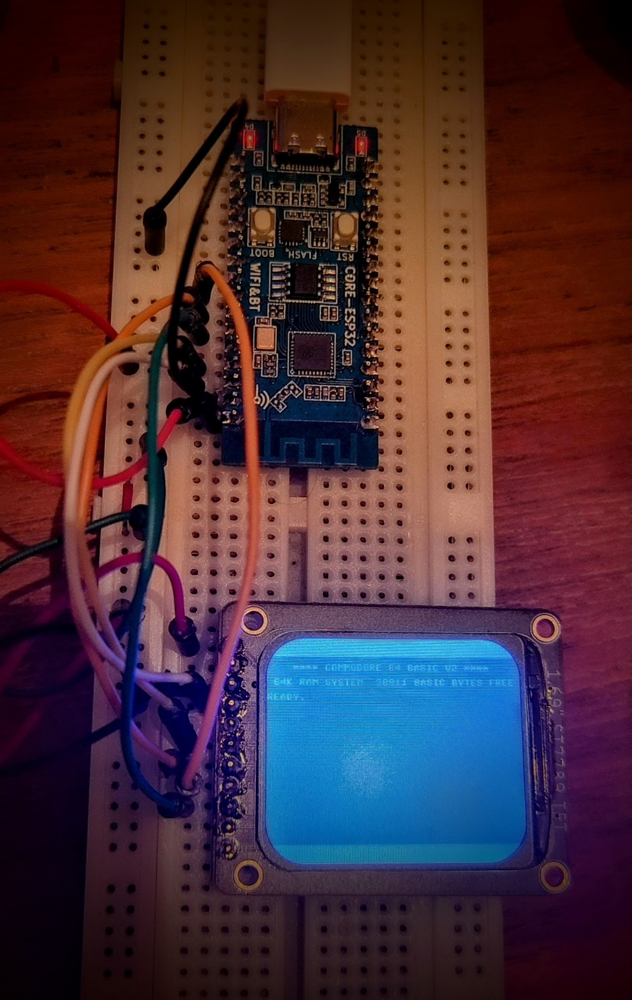

# ESP-C3 (RISC-V) C64 #

[Core ESP32-C3](https://wiki.luatos.org/chips/esp32c3/board.html) with [Adafruit 1.69" ST7789 TFT](https://www.adafruit.com/product/5206)
and see browser-keyscan-helper for keyboard support

***For BETTER support see [unified branch](https://github.com/davervw/c-simple-emu6502-cbm/tree/unified)
