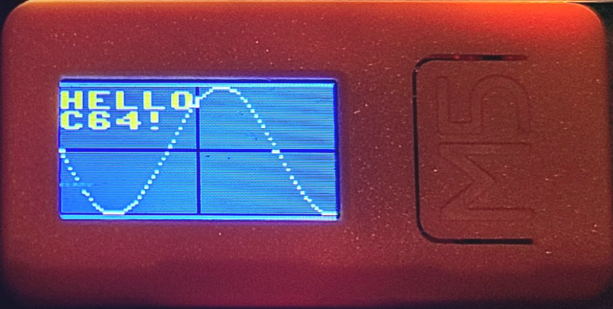
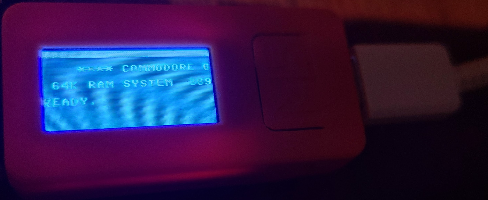
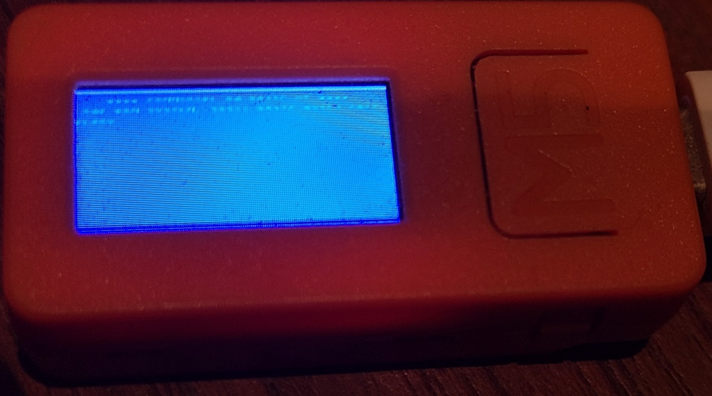

# M5Stick-C C64 #

***For BETTER solutions (not M5Stick-C) see [unified](https://github.com/davervw/c-simple-emu6502-cbm/tree/unified#unified---commodore-and-minimal-6502-emulator-for-various-targets) branch supporting more capable M5Stack devices, and other devices with larger LCD screens and extra RAM for D64 and C128, Vic-20 support.  Also see [master](https://github.com/davervw/c-simple-emu6502-cbm/tree/master) branch for list of supported platforms.***

This is a static snapshot of the m5 project supporting an M5Stick-C without SD/D64/C128 support, features include rendering full color screen on LCD.  LOAD/SAVE of individual files are supported if you can manage to include a FFAT partition in flash.

Open browser-keyscan-helper/index.html to run an adapter with instructions how to use a keyboard via serial from a desktop web browser (e.g. Chrome). 

Better yet, use this model assisting as a BLE keyboard for a higher resolution model