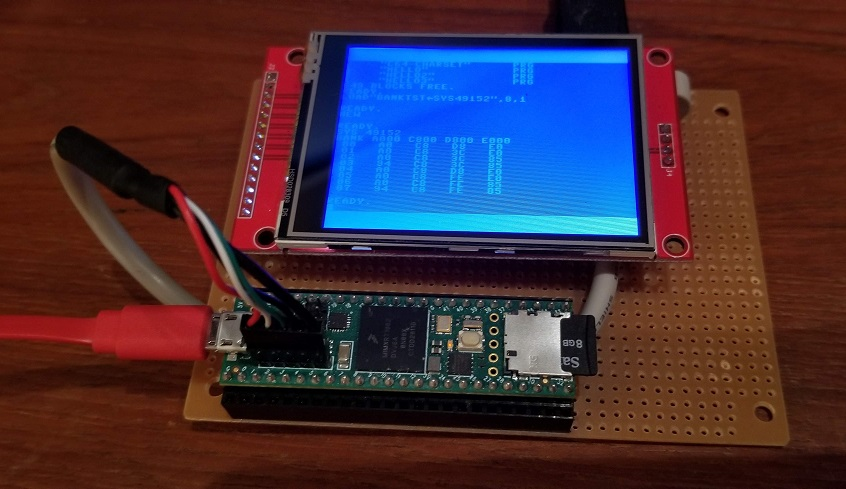

# Teensy C64 #

>
> *TLDR; This is an outdated version, fast-forward to [Unified](https://github.com/davervw/c-simple-emu6502-cbm/blob/master/README.md#unified-lcd--graphical) to see the latest changes*
>

Here is a simple Commodore 64 and 6502 Emulator I wrote from scratch, ported to C and C++ from my C# [simple-emu-c64](https://github.com/davervw/simple-emu-c64) project, and portions ported from my [STMF429Discovery](https://techwithdave.davevw.com/2020/04/commodore-64-for-stm32f429-discovery.html) project.  Requires USB host port for USB keyboard.

* Development environment is Arduino IDE (1.8.5 or later)
* Third party libraries used are Teensyduino, USBHost, and [ILI9341](https://github.com/KurtE/ILI9341_t3n.git) or [ILI9488](https://github.com/mjs513/ILI9488_t3.git)
* Tested with Teensy 4.1, ILI9341 240x320 -and- ILI9488 320x480 LCD screens (choose one), USB keyboard support, and SD card
* Displays C64 color text screen to LCD with PETSCII supporting graphic characters and lowercase characters
* IRQ 1/60 second is working (e.g. TI and TI$)
* Sorry emulation is limited.  No games!
* Yes, there is D64 support.  Disks are automatically attached with disks/drive8.d64 and disks/drive9.d64 from SD card

````
Built successfully with Arduino IDE 2.1.1 and Teensyduino 1.57.2 (note: compiler error with 1.58.1)

and choose one LCD in emuc64.cpp
#define ILI9341 // 240x320
#define ILI9488 // 320x480

````


Wiring listed in LCD pin ordering

| Teensy Pin   | LCD Pin     |
| ------------ | ----------- |
| Vin (USB 5V) | LCD VCC     |
| GND          | LCD GND     |
| 10 CS        | LCD CS      |
| 3.3V         | LCD RESET   |
| 9            | LCD DC      |
| 11 MOSI      | LCD SI/MOSI |
| 13 SCK       | LCD SCK     |
|              | LCD LED     |
| 12 MISO      | LCD SO/MISO |

And 100 Ohm resistor between LCD VCC and LCD LED backlight pins

LCD Touch pins are not connected, not used in software
