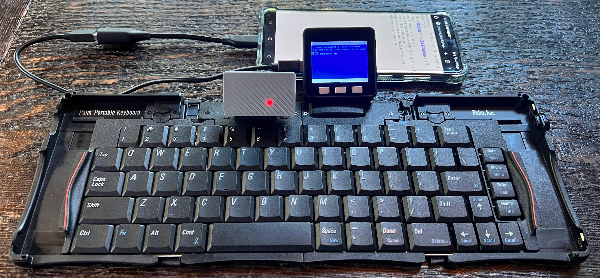
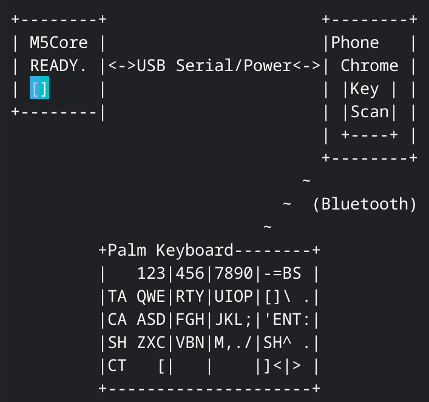
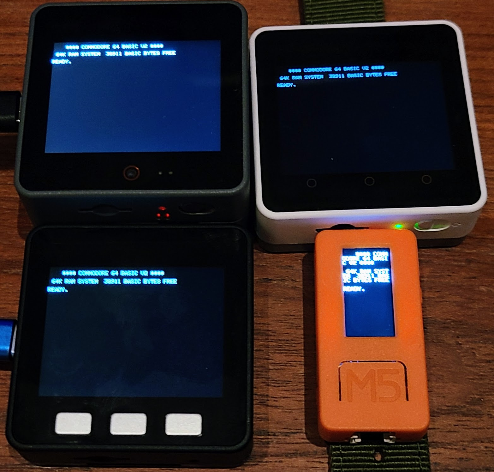

# M5Core C64 with GO 128 #


Work in progress.  Current state includes rendering full color screen on M5Core LCD and supporting multiple Core models with a define change in M5Core.h.  60 times a second IRQ implemented to blink cursor. Requires SD support for roms, tested with Core2 and CoreS3 (must change defines in local M5Core.h).   GO 128 and GO 64 switch back and forth.

Open browser-keyscan-helper/index.html to run an adapter with instructions how to use a keyboard via serial from a desktop web browser (e.g. Chrome).

```
TODO: integrate web-serial-polyfill because Chrome mobile web browser doesn't support Serial APIs directly.
```








* Basic Core (not supported without extra RAM)
* Core2
* CoreS3
* Whoops, screen not big enough on StickC
