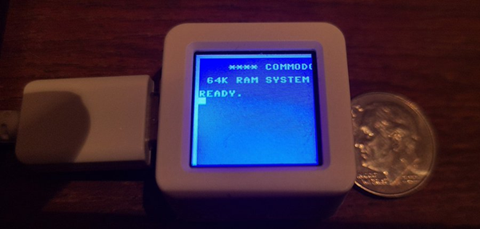
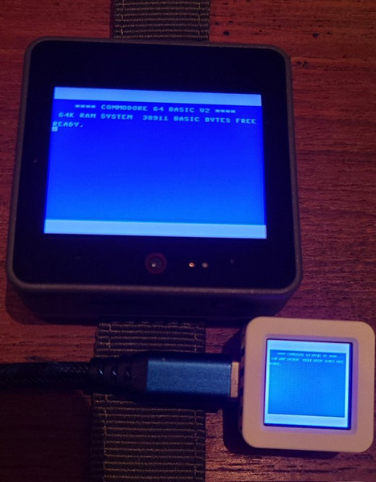

# M5 Atom S3 C64 #

***For BETTER support see [M5 branch](https://github.com/davervw/c-simple-emu6502-cbm/tree/m5) supporting CoreFireIoT,CoreS2,CoreS3 which have extra RAM for D64 and C128 support.  Also see [master branch](https://github.com/davervw/c-simple-emu6502-cbm/tree/master) for list of supported platforms.***

This is a static snapshot of the m5 project supporting an Atom S3 without SD/D64/C128 support, features include rendering full color screen on LCD both scaled, and pixel perfect where you tilt to see different sixths of the full screen. Press the screen (button) until it clicks to toggle between scaled and pixel perfect.

If you really do need to build this, it can build with Arduino IDE 2.3.6, M5Stack board support 2.1.0, M5AtomS3 library 0.0.3, M5GFX 0.1.10, M5Unified 0.1.10, M5Utility 0.0.3.  Be sure to turn USB CDC on Boot to Disabled, Flash size 8MB, Flash mode QIO 80MHz, a partition scheme with FATFS, PSRAM disabled.  Note does not work with AtomS3R (PSRAM version) as is, some changes are needed, probably newer versions too.

Open browser-keyscan-helper/index.html to run an adapter with instructions how to use a keyboard via serial from a desktop web browser (e.g. Chrome). 

Comparison with its bigger brother (M5CoreS3)

