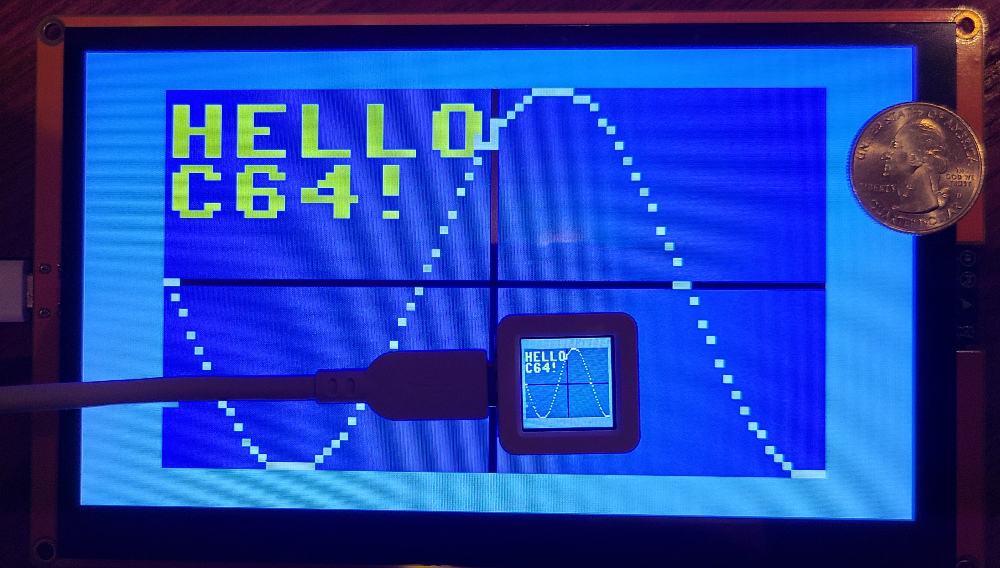
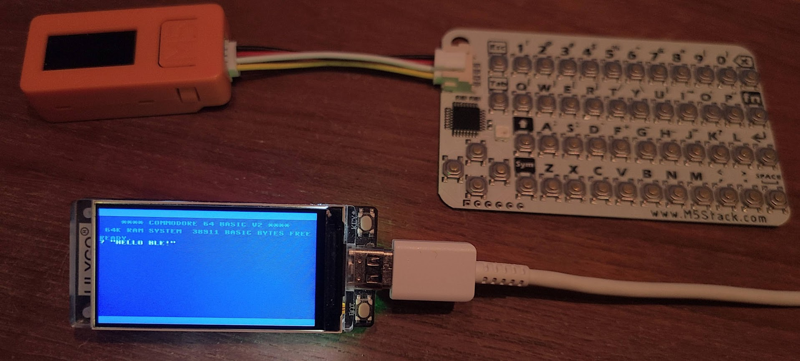

# ESP32-8048S070 #

>
> *TLDR; This is an outdated version, fast-forward to [Unified](https://github.com/davervw/c-simple-emu6502-cbm/tree/unified#unified---commodore-and-minimal-6502-emulator-for-various-targets) to see the latest changes*
>

Another simple C64 emulator port for Sunton ESP32-8048S070

Supports browser-keyscan-helper (see included folder) for connecting via USB Serial to PC, use Chrome browser for keyboard entry

