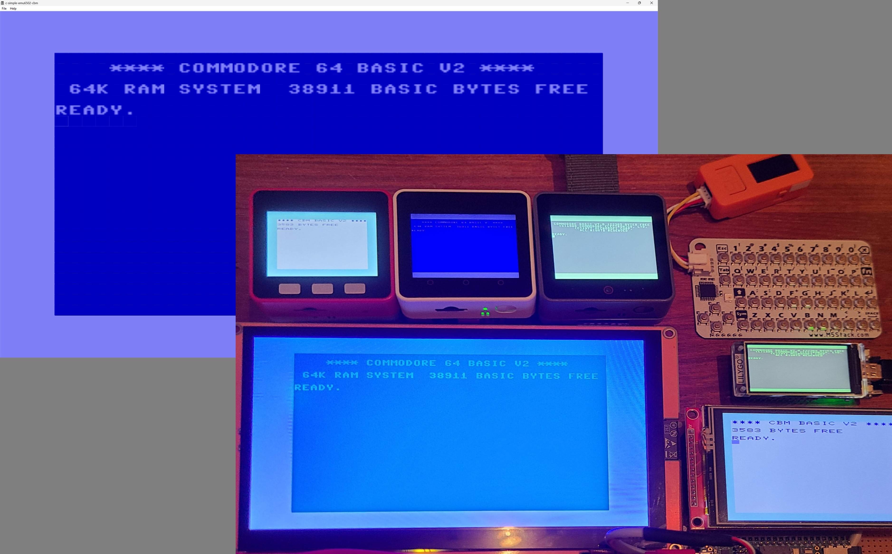

# *Unified* - Commodore and minimal 6502 emulator for various targets #



This unified version is a single common source code base supporting multiple targets listed below.  The primary advantage to common source is sharing features between targets.  Features include rendering color text screen on LCD and supporting multiple models.  60 times a second IRQ implemented to blink cursor. Requires PSRAM plus SD (or FFAT partition) for support for roms and .D64/1541 floppy emulation.   GO 128, GO 20, GO 64, and GO 1 commands switch back and forth between systems.  6502 and BASIC programs are supported, focused on text emulation.  Sorry, no sound, no graphics, no sprites, no joysticks, no games.  This is my emulator, my way.

GO 1 is a minimum environment similar to an Apple 1, except using MC6850 UART (instead of MOS6551), and has no other hardware besides RAM, and the ROM you feed it (via code).  It has been known to run [wozmon](https://github.com/davervw/c-simple-emu6502-cbm/blob/master/roms/minimum/wozmon.bin) and [a1basic](https://github.com/jefftranter/6502/tree/master/asm/a1basic), both requiring minor porting to the MC6850.  The minimum environment is conveniently hooked up to a virtual terminal though, so you do have a screen and keyboard.

## Compatible hardware ##

| Hardware Model        | LCD details               | Storage | Notes                   | MCU         | BLE | USB kbd. |
| --------------------- | ------------------------- | ------- | ----------------------- | ----------- | --- | -------- |
| M5Stack Core2         | 2" ILI9342C 320x240       | MicroSD | optional wristband      | ESP32       | Yes | No       |
| M5Stack CoreS3        | 2" ILI9342C 320x240       | MicroSD | optional wristband      | ESP32-S3    | Yes | No       |       
| M5Stack Core Fire     | 2" ILI9342C 320x240       | MicroSD | (not compat. w/ band)   | ESP32       | Yes | No       |
| Sunton ESP32-804S070  | 7" GFX 800x480            | MicroSD | Arduino GFX driver      | ESP32-S3    | Yes | No       |
| Teensy 4.1 with PSRAM | 2.8"-3.2" ILI9341 320x240 | MicroSD | or 3.5" ILI9488 480x320 | NXP i.MX RT | No  | Yes      |
| LilyGo T-Display-S3   | 1.9" TFT_eSPI 320x170     | FFAT    | flash parition          | ESP32-S3    | Yes | No       |
| Microsoft Windows     | Any" External monitor     | SSD/HD  | Direct2D, Visual Studio | CPU         | No  | Yes,etc. |

## Build instructions ##

1. Clone repository, switch to branch unified
2. Open src/c-simple-emu6502-cbm/c-simple-emu6502-cbm.ino with Arduino 2.x IDE
3. Embedded?  Select compatible target in Adrudino 2.x IDE, build and deploy, should complain "Card Mount Failed" or similar
   Windows? Select compatible target in Visual Studio 2022 IDE, build and deploy, needs roms folder in current directory
4. Insert MicroSD with the following files (roms from Vice or similar, disk files optional), and reset; or [detailed instructions for LilyGo T-Display-S3 with FFAT partition](https://github.com/davervw/c-simple-emu6502-cbm/tree/lilygo-t-display-s3)

```
roms\c64\basic
roms\c64\chargen
roms\c64\kernal
roms\c128\basiclo
roms\c128\basichi
roms\c128\chargen
roms\c128\kernal
disks\drive8.d64
disks\drive9.d64
```

Notes:

* LOAD/SAVE/VERIFY/LOAD"$" commands are intercepted by emulator.  There are some bugs in C128 for LOAD, so user beware.  There is no DOS for status, rename, delete, etc.  SAVE always ovewrites without warning in this emulator.
* GO 128 command added for switching to Commodore 128 mode (how? intercepted by the emulator).   Also GO 64, GO 20 working in these supported Commodore platforms.
* Keyboard is I2C attached M5Stack CardKB, or a serial attached helper that sends scan codes.  It can also be a web page -- see [browser-keyscan-helper](https://github.com/davervw/c-simple-emu6502-cbm/tree/unified/src/browser-keyscan-helper) with USB serial attachment, or a physical device attached to M5 Core Port.A -- see project [c128_keyscan](https://github.com/davervw/c128_keyscan/tree/ninetyone_tx2_itsy_bitsy).  I use both standard USB or Bluetooth keyboards, and my original C128D external keyboard.  
* Or keyboard is custom BLE server for serial or M5 CardKB (I2C) keyboard attached to M5Stack M5-Stick-C or similar (see [src/BLE_commodore_keyboard_server project](https://github.com/davervw/c-simple-emu6502-cbm/tree/unified/src/BLE_commodore_keyboard_server)) 
* Different hardware has different capabilities.  
* M5 Fire has three physical buttons that act as cursor up/down and Enter (also left two does Shift-Run, and outer left/right switch to next emulator).
* Supporting different LCD resolutions different than Commodore supported has been an exercise in upscaling and downscaling.
* VDC 8563/8568 text emulation is included in the Commodore 128 emulator only.  Use GRAPHIC 5 command to switch to the 80 column text screen.   GRAPHIC 0 will return to the 40 column screen.
* There is no fast mode of C128.   The emulator runs flat out as much as it can all the time.  No effort has been made to be cycle accurate.
* This emulator does not have a C64 within C128 mode implemented.  GO 64 will switch to a strict 64 only mode.  None of the C128 hardware will be present in 64 mode.  No VDC, no fast mode, no extended keyboard scan codes (extended keys are translated to C64 scan codes though for convenience).

See more description at blog entries:

* [Commodore keyboards go wireless...](https://techwithdave.davevw.com/2023/12/commodore-keyboards-go-wireless-for-my.html)
* [7" LCD (ESP32)...](https://techwithdave.davevw.com/2023/12/7-lcd-esp32-with-c64-text-emulator.html)
* [New! and Improved!...](https://techwithdave.davevw.com/2023/12/new-and-improved-c64-text-emulator.html)
* [When Emulation goes wrong](https://techwithdave.davevw.com/2023/11/when-emulation-goes-wrong.html)
* [Extremely small emulated C64 and C128](https://techwithdave.davevw.com/2023/06/extremely-small-emulated-c64.html)
* [GO 128 enhancement for Commodore](https://techwithdave.davevw.com/2022/05/go.html)
* [C128 model support added to simple 6502 Commodore emulator](https://techwithdave.davevw.com/2022/05/simplec128.html)
* [C64 Emulator for Teensy 4.1](https://techwithdave.davevw.com/2021/02/c64-emulator-for-teensy-41-lcdusbsd.html)
* [LCD version of 6502 emulators ported to Windows](https://techwithdave.davevw.com/2024/05/lcd-version-of-6502-emulators-ported-to.html)

Open src/browser-keyscan-helper/index.html to run an adapter with instructions how to use a keyboard via serial from a desktop web browser (e.g. Chrome).
